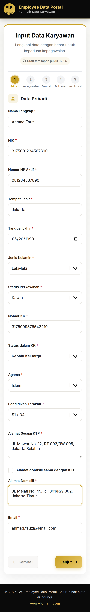
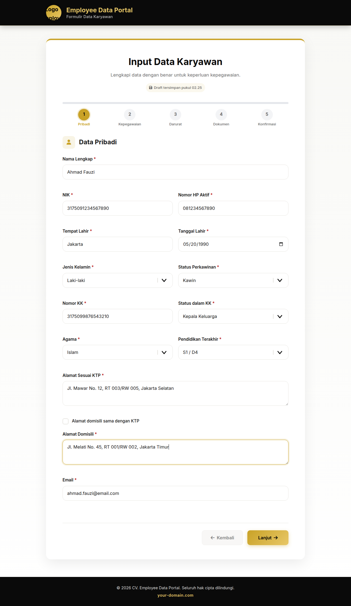
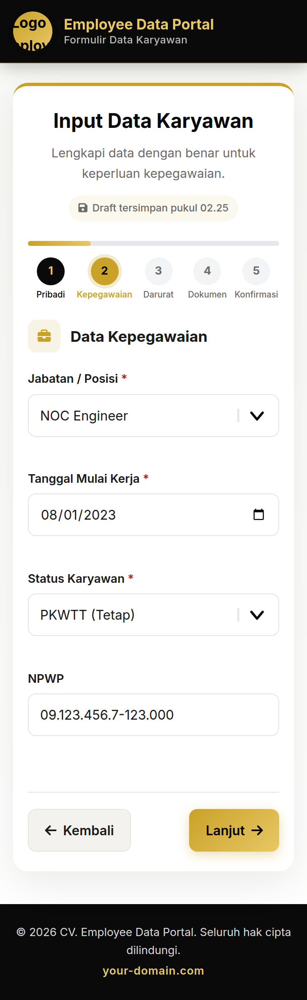
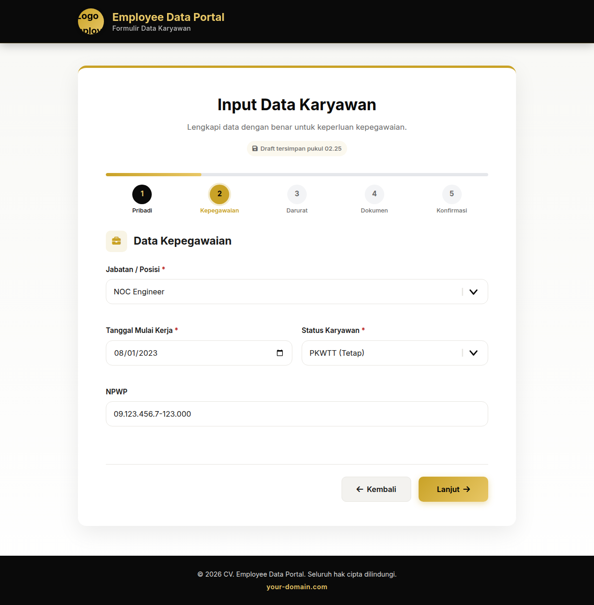
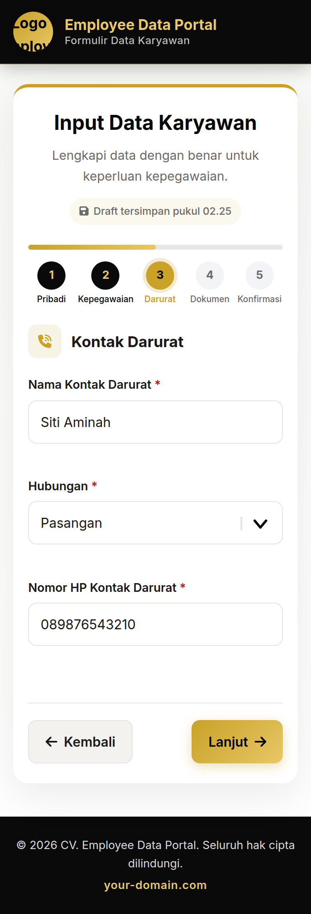
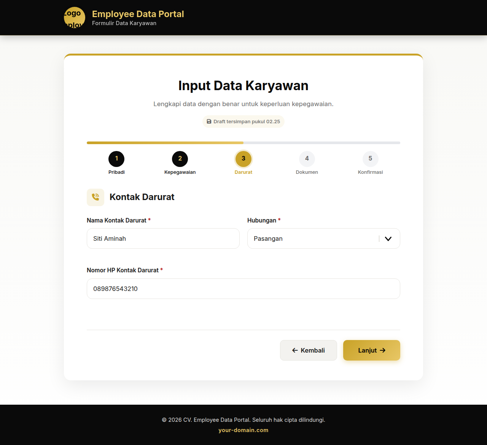
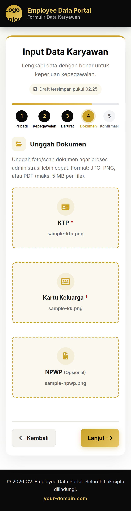
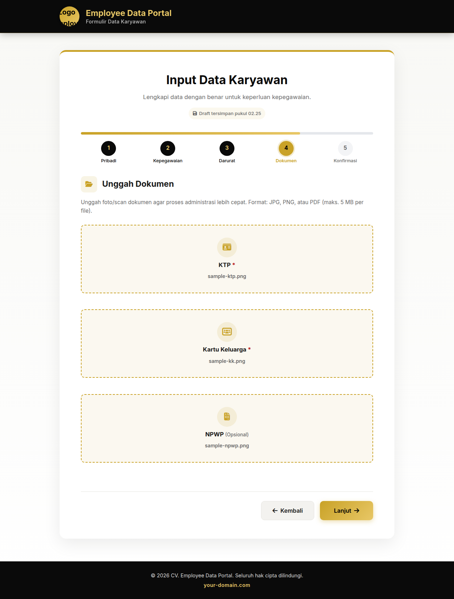
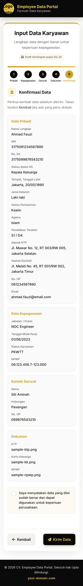
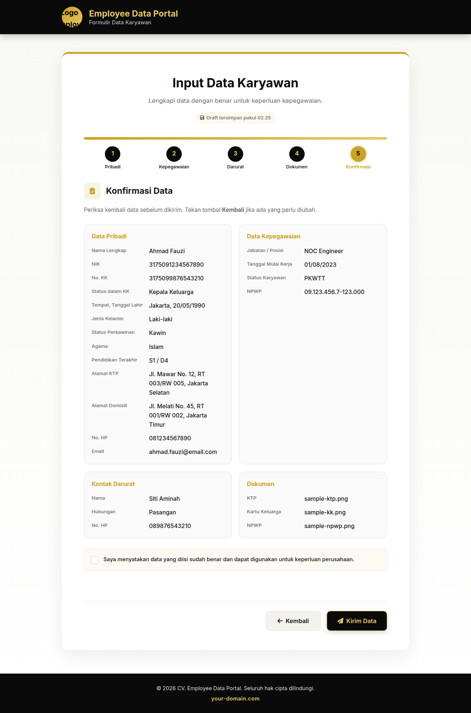

# Employee Data Form

A professional, responsive, multi-step employee data collection form integrated with **Google Sheets** and **Google Drive** via a custom API built on **Google Apps Script**.

> 🔒 This is a portfolio showcase version. Sensitive credentials such as API URL, folder ID, and access token have been replaced with placeholders.

---

## 🚀 Live Demo

🌐 **Demo:** [https://data.your-domain.com](https://data.your-domain.com) *(replace with your own deployment)*

---

## ✨ Features

- **Responsive Design** — Optimized separately for mobile and desktop.
- **Multi-Step Form** — 5 clean steps: Personal Data, Employment, Emergency Contact, Documents, Confirmation.
- **Real-Time Validation** — NIK, KK, phone, email, date, and required field validation.
- **Auto-Save Draft** — Form progress is saved in the browser automatically.
- **File Uploads** — KTP and KK are required; NPWP is optional. Files are uploaded to Google Drive.
- **Google Sheets Backend** — All submitted data is stored in a structured spreadsheet.
- **Email Notification** — HR/admin receives an email alert for every new submission.
- **API Token Security** — Backend validates a secret token on every request.

---

## 🛠️ Tech Stack

| Layer | Technology |
|---|---|
| Frontend | HTML5, CSS3, Vanilla JavaScript |
| Backend | Google Apps Script (REST API) |
| Database | Google Sheets |
| File Storage | Google Drive |
| Fonts | Inter (Google Fonts) |
| Icons | Font Awesome |

---

## 📁 Project Structure

```text
.
├── index.html              # Multi-step form UI
├── mobile.css              # Mobile-first base styles
├── desktop.css             # Desktop-specific overrides
├── script.js               # Form logic, validation, draft, API submit
├── apps-script/
│   └── Code.gs             # Google Apps Script backend API
├── API.md                  # API documentation
├── SETUP.md                # Deployment guide
└── README.md               # This file
```

---

## 📸 Screenshots

Screenshots were captured from the portfolio showcase build with sample data filled in.

### 1. Data Pribadi
| Mobile | Desktop |
|---|---|
|  |  |

### 2. Data Kepegawaian
| Mobile | Desktop |
|---|---|
|  |  |

### 3. Kontak Darurat
| Mobile | Desktop |
|---|---|
|  |  |

### 4. Unggah Dokumen
| Mobile | Desktop |
|---|---|
|  |  |

### 5. Konfirmasi Data
| Mobile | Desktop |
|---|---|
|  |  |

---

## ⚙️ How It Works

1. User fills the multi-step form on the frontend.
2. On the final step, the browser sends a JSON payload to the Google Apps Script Web App.
3. The backend validates the token, saves the data to Google Sheets, and uploads documents to Google Drive.
4. A confirmation screen is shown to the user.
5. An email notification is sent to the configured admin address.

---

## 🚀 Getting Started

### 1. Prerequisites

- A Google account
- A domain or subdomain to host the static files
- Basic knowledge of Google Apps Script (or follow `SETUP.md`)

### 2. Backend Setup

1. Create a new Google Sheet.
2. Create a folder in Google Drive for uploaded documents.
3. Open **Extensions → Apps Script** from the Sheet.
4. Paste the contents of `apps-script/Code.gs`.
5. Replace placeholders:
   - `YOUR_FOLDER_ID`
   - `your-email@example.com`
   - `YOUR_SECRET_TOKEN`
6. Deploy as a **Web app** with **Execute as: Me** and **Who has access: Anyone**.
7. Copy the Web App URL.

### 3. Frontend Setup

1. Update `script.js`:
   ```js
   const APPS_SCRIPT_URL = 'https://script.google.com/macros/s/YOUR_SCRIPT_ID/exec';
   ```
2. Upload all frontend files to your hosting/subdomain.
3. Test the form.

For the full step-by-step guide, see [`SETUP.md`](SETUP.md).

---

## 📡 API Reference

See [`API.md`](API.md) for detailed endpoint and request/response examples.

---

## 🔒 Security Notes

- The frontend includes the API token, so this form is intended for **internal/controlled use**.
- For production, consider adding reCAPTCHA or restricting access by IP/domain.
- Never commit real credentials to public repositories.

---

## 🙋‍♂️ About This Project

This project was built to demonstrate the ability to create a complete, production-ready form solution using only static frontend technologies and serverless Google services.

---

## 📄 License

MIT License — feel free to use and modify for your own projects.
